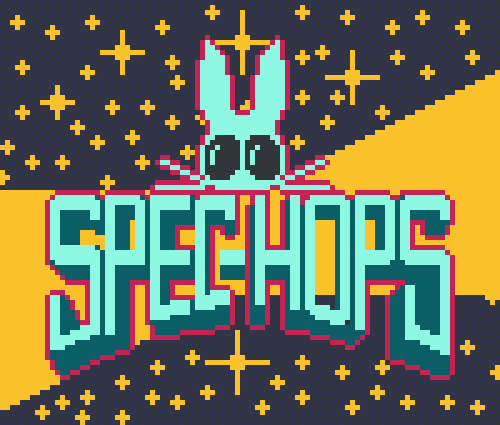

## Play now in your browser!

[Online demo](https://alexpop11.github.io/Spec-Hops/)

## Build and run

### Desktop builds

Building is easiest with cmake:

```
// clone and cd into the repo
git submodule update --init --recursive
mkdir build
cd build
// install dependencies: cmake, ninja, opengl
// detailed instructions are in .github/workflows/release.yaml
cmake -GNinja -DCMAKE_BUILD_TYPE=Release .. && ninja && ./OpenGL/Spec-Hops
```

to run:
```
# from within the build directory
./OpenGL/Spec-Hops
```

to package a desktop build:
1. You need one folder called `res` with the contents of `OpenGL/res/*` and the built binary to sit next to one another. You also need the dawn dynamic library to be in there right next to the spec-hops binary. TODO: statically link dawn, which is apparently hard: https://github.com/eliemichel/WebGPU-distribution/issues/34
2. TODO: Mac instructions
3. TODO: Linux instructions 

### Web builds

```
git submodule update --init --recursive
mkdir build_emscripten && cd build_emscripten
emcmake cmake -DCMAKE_BUILD_TYPE=Release ..
emmake make
```

To run:

```
python -m http.server
```

Then check out http://localhost:8000/OpenGL/Spec-Hops.html 

## Thanks

1. [This page from Alister Chowdhury](https://alister-chowdhury.github.io/posts/20230620-raytracing-in-2d/) which Andre wish he'd found earlier.
